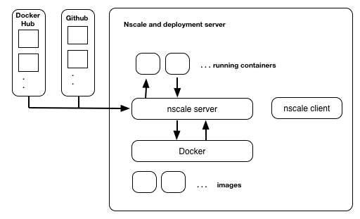
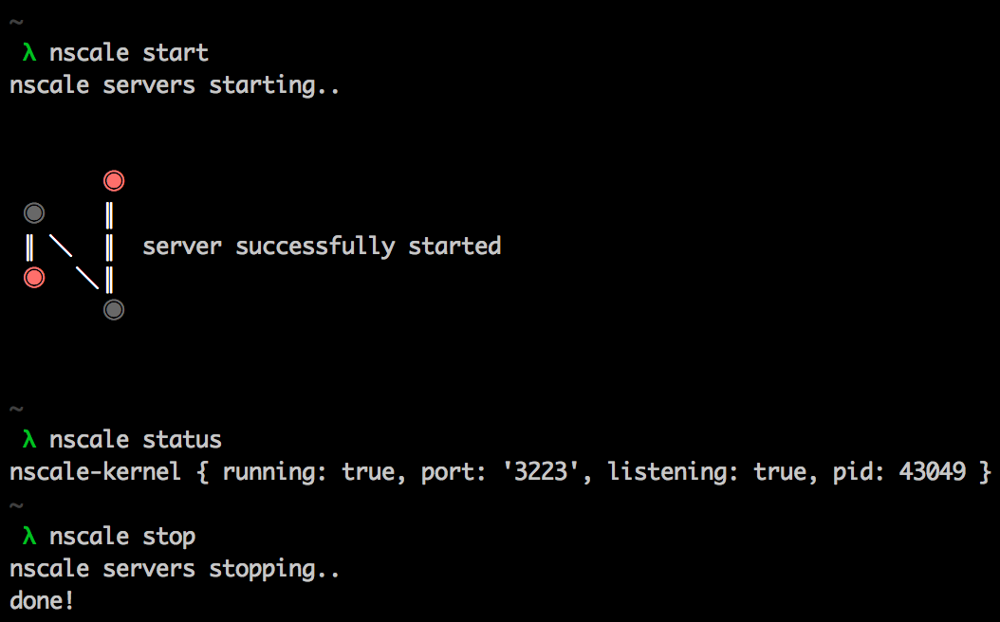

[](https://gitter.im/nearform/nscale?utm_source=badge&utm_medium=badge&utm_campaign=pr-badge&utm_content=badge)

> A toolkit for application deployment and container management

__nscale__ is an open toolkit supporting configuration, build and deployment of connected container sets. nscale is ideally used to support the development and operation of __microservice__ based systems.

Unlike other distributed container management systems, nscale aims to do the __simplest thing that could possibly work__. nscale aims to be simple to setup, configure and operate.

Full documentation including setup guides and tutorials are available 
[here](https://github.com/nearform/nscale-docs).

__nscale__ depends on [nodejs](http://nodejs.org/), [npm](http://npmjs.org/), [git](http://git-scm.com/) and [docker](http://docker.io).

## Overview
Typically an nscale deployment consists of a management server running nscale and a number of managed systems. Each of the managed systems requires a docker runtime only. nscale helps you perform the following tasks:

- Build and manage containers
- Define system infrastructure
- Track system changes over time
- Track deployment history
- Perform immutable deployments
- Perform fast safe rollback to known good state
- Perform homeostatic monitoring and updates
- Perform algorithmic deployments

nscale can run in a local development configuration on a single system or as a management system for multipe target servers.

### Development configuration


In a development configuration, the nscale server and running containers live on the same system. This is a great way to get started with nscale or to use it for local development and testing.
As of v0.16, nscale supports running containers as processes, this mode is called 'process-container', and it supports automatic reloading if files are changed.

### Production configuration


In a prodction configuration, the nscale server is installed on a managment instance and is configured to manage and control a set of controlled server instances. This configuration is commonly used on top of cloud infrastructure or on premesis servers.

## Quickstart
These quickstart instructions will get you up and running with nscale in a local development configuration. For more advanced use cases including production configrations on top of AWS please see the [documentation](https://github.com/nearform/nscale-docs).

### Install docker

#### Mac
If you are on Mac OS X, you need to install and run [boot2docker](https://github.com/boot2docker/boot2docker). Once you have installed boot2docker start it using:

```sh
boot2docker init
```

```sh
boot2docker up
```

__IMPORTANT!!!! - Follow the instructions given by boot2docker and ensure that the correct environement variables are set!__

#### Linux
If you are on Linux, you will need to install [docker](http://docker.io). Once you have docker installed and running you will need to add your user account to the docker group. To do this run the following:

```sh
sudo usermod -G docker -a `whoami`
```

You may need to log out and log back in again for this change to take effect. To confirm that you have the appropriate permissions run:

```sh
groups
```

You should see that your user is included in the docker group. If this is not apparent you may need to close your current terminal session and login again.

__IMPORTANT!!!! nscale will not function correctly unless the group permissions are set as above__

#### Other Platforms
We understand that there exist other operating systems, however at this time we do not support nscale on them. If you are feeling brave by all means give it a try, we always appreciate __pull requests!!__

### Install node

nscale is built using node.js. To install node, go to the [download page](http://www.nodejs.org) and install the appropritae binary for your system. 

### Install git
nscale uses git as a backing store for system configuration and versioning. Git can be installed using the package manager on your system of choice (i.e. homebrew on osx, apt-get on ubuntu...)

### Configure github access
Once git is installed, it should be configured for use with github if you wish to follow along with the nscale tutorials. You should run the following to set your username and email address:

```sh
git config --global user.name "<user name>"
```

```sh
git config --global user.email "<email>"
```

You will need to configure ssh access to github. See [this guide](https://help.github.com/articles/generating-ssh-keys/) to get ssh keys setup.

### Install nscale
nscale can be installed using npm. To install the latest version run:

```sh
[sudo] npm install -g nscale
```

### Preflight check
Before running nscale please ensure that the terminal you are running in is correctly configured with the above pre-requisties.

#### github
Ensure github is correctly configured by checking the output of the following command

```sh
ssh -T -o "VerifyHostKeyDNS yes" git@github.com
```

#### docker
Ensure that docker can run correctly by executing the following command

```sh
docker ps
```

Note that this command should run __WITHOUT NEEDING SUDO__.

__IMPORTANT!!! If the above checks do not run cleanly, please go back and check your configuration. Don't even think about starting nscale until this is corrected. Seriously... we mean it - We'll be very sad otherwise :(__

### Running nscale

_nscale start/stop cycle._

Now that everything is configured you are good to start nscale:

```sh
nscale start
```

If you are running on Linux, you need to add yourself to the `docker`
group before running any `nscale` command. To do that:

```sh
nscale login
```

Finally let's check that nscale is good to go by running:

```sh
nscale status
```

You should see output similar to the following
```sh
nscale-kernel { running: true, port: '3223', listening: true, pid: 1294 }
```

### Run a demo application
You should now be able to clone and run a small demo application. To do this cd into a new empty working directory and clone the repository:

```sh
mkdir ~/work; cd ~/work
```

```sh
git clone git@github.com:nearform/nscaledemo.git
```

This will create a sub directory named nscaledemo. You now need to link this repository into nscale. By running:

```sh
nscale system link nscaledemo
```

Check that the system was linked in correctly by running a system list command again. Which should now contian the linked system:

```sh
nscale system list
```

```sh
Name                           Id
nscaledemo                     e1144711-47bb-5931-9117-94f01dd20f6f
```


#### Compile the system definition
In order to work with the demo system we first need to run a compile.

```sh
nscale system compile nscaledemo
```

Once the compile has completed you should be able to list the available containers in the system. Run:

```sh
nscale container list nscaledemo
```

You should see the following output

```sh
Name                 Type                 Id
root                 container            85d99b2c-06d0-5485-9501-4d4ed429799c
web                  process              web$2f9f7ddadc8bead84de4a74665085d362b1..
```

#### Build the demo container
Next you will need to build the example container. To do this run:

```sh
nscale container build nscaledemo web
```

This command will create a docker container ready for nscale to start.

#### Run the demo
Before we run the system, take a quick look at the revsion list:

```sh
nscale revision list nscaledemo
```

This command shows a list of the revisions on this system repository. You will see a number of commits from the repository that was originally cloned plus a fresh commit representing the compile that was executed a few steps above. Go ahead and run the system by executing:

```sh
nscale revision deploy nscaledemo latest development
```

nscale will start the demo container. You can check that all is well by running:

```sh
nscale system check nscaledemo development
```

And check that the web container is running using:

```sh
docker ps
```

You should be able to open a browser and point it to the boot2docker ip address (mac os X) or localhost (linux) port 8000. This should display the string 'hello world'. You can get the boot2docker ip address with the following command:

```sh
boot2docker ip
```

So, you can run:

```sh
open http://`boot2docker ip`:8000
```

## Next steps
Full documentation for nscale is available on the nscale document repository [here](https://github.com/nearform/nscale-docs).

## License

Copyright (c) 2014-2015 Nearform and other contributors

Licensed under the Artistic License 2.0
